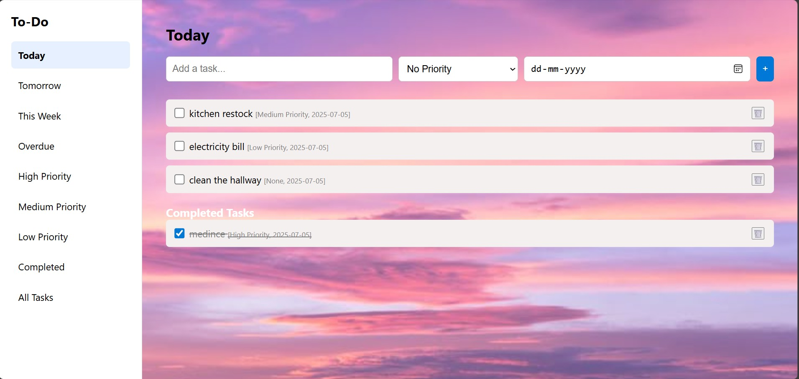

# To-Do List Web App 📝

A sleek and organized To-Do app inspired by Microsoft To-Do and Focus-To-Do.

## 🔧 Features
- Add tasks with priority and due date
- Filter by: Today, Tomorrow, This Week, Overdue, Priority
- Completed tasks section (with subheadings)
- Stylish background image (pink clouded sky)

## 🖼 Screenshot

## 📁 Folder Structure
- `index.html` – main structure
- `style.css` – layout and design
- `script.js` – app logic
- `bg.jpg` – background image
- `README.md` – this file

## 👩‍💻 Created by:
Thenmozhi 
